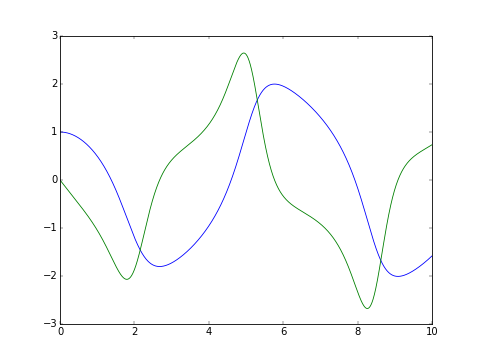

===========
pygslodeiv2
===========

.. image:: http://hera.physchem.kth.se:8080/github.com/bjodah/pygslodeiv2/status.svg?branch=master
   :target: http://hera.physchem.kth.se:8080/github.com/bjodah/pygslodeiv2
   :alt: Build status

``pygslodeiv2`` provides a `Python <http://www.python.org>`_ binding to the
`Ordinary Differential Equation <https://en.wikipedia.org/wiki/Ordinary_differential_equation>`_
integration routines exposed by the `odeiv2 interface <https://www.gnu.org/software/gsl/manual/html_node/Ordinary-Differential-Equations.html>`_ of
`GSL - GNU Scientific Library <http://www.gnu.org/software/gsl/>`_.
The odeiv2 interface allows a user to numerically integrate (systems of) differential equations.

Example
=======
The classic van der Pol oscillator (see `examples/van_der_pol.py <examples/van_der_pol.py>`_)

.. code:: python

   >>> from pygslodeiv2 import integrate_adaptive
   >>> mu = 1.0
   >>> def f(t, y, dydt):
   ...     dydt[0] = y[1]
   ...     dydt[1] = -y[0] + mu*y[1]*(1 - y[0]**2)
   ... 
   >>> def j(t, y, Jmat, dfdt):
   ...     Jmat[0, 0] = 0
   ...     Jmat[0, 1] = 1
   ...     Jmat[1, 0] = -1 -mu*2*y[1]*y[0]
   ...     Jmat[1, 1] = mu*(1 - y[0]**2)
   ...     dfdt[0] = 0
   ...     dfdt[1] = 0
   ...
   >>> y0 = [1, 0]; tend=10.0; dt0=1e-8; t0=0.0; atol=1e-8; rtol=1e-8
   >>> tout, yout = integrate_adaptive(f, j, 2, y0, t0, tend, atol, rtol, dt0)

License
=======
The source code is Open Source and is released under GNU GPL v3. See `LICENSE <LICENSE>`_ for further details.
Contributors are welcome to suggest improvements at https://github.com/bjodah/pygslodeiv2

Author
======
Björn I. Dahlgren, contact:

- gmail address: bjodah
- kth.se address: bda
